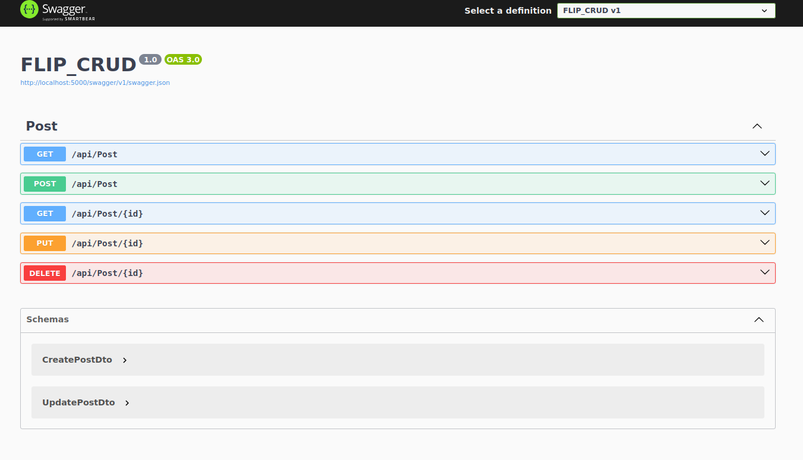
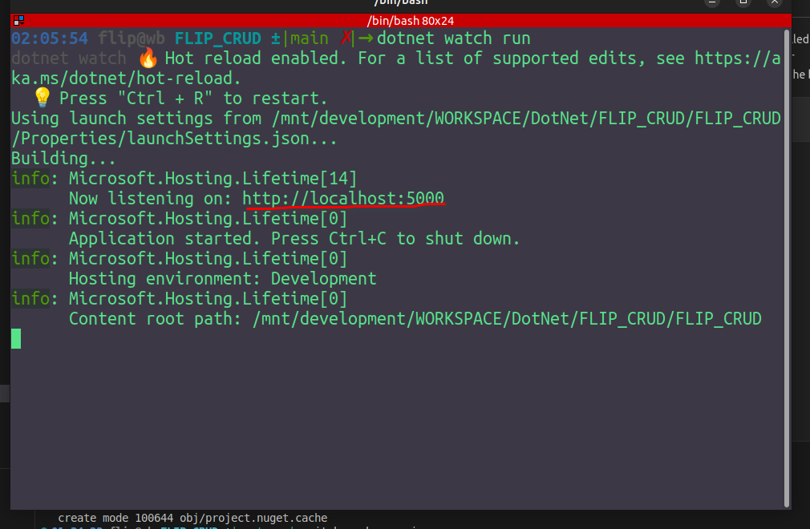

# CRUD API (C# core web api)

### this a crud demo project  created with dotnet c# core web api (.NET 9) 
### using Swagger for better description for APIs


## swagger screnshot



## SETUP YOUR PC for localdevelopment
### setup dotnet
 for WINDOWS [ click here](https://learn.microsoft.com/en-us/dotnet/core/install/windows) \
 for LINUX(UBUNTU)  [ click here](https://learn.microsoft.com/en-us/dotnet/core/install/linux-ubuntu-install?pivots=os-linux-ubuntu-2410&tabs=dotnet9)

### set MYSQL database
I am using MYSQL Database 


 ---

## RUN PROJECT

Before run the Project
please create `.env`  file from `.env.example`
after that setup Mysql credentials into `.env` file

After successfully installed dotnet sdk \
goto project root folder \
open terminal and run the belows command \
```
dotnet run 
```

### after successfully run the project in terminal you will see




